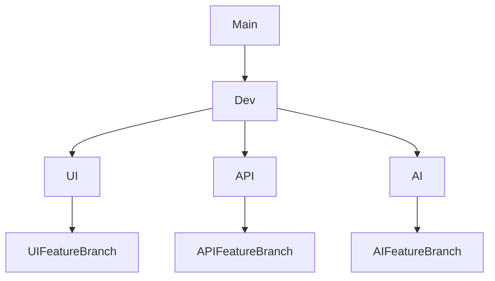

# 📄 CV-Scanner
---

## 📊 Project Metrics

---

## 🔗 Demo Links

## Project Deliverables

| Deliverable   | Demo 1 | Demo 2 | Demo 3 |
|---------------|--------|--------|--------|
| **Video**     | [Demo1 Video](https://drive.google.com/file/d/1BtbS0klLEC0HWkYhbL0k7NyrCFnGpLrS/view?usp=sharing) | [Demo2 Video](https://drive.google.com/file/d/1AOb6-VEAaabk0FddT4uh2BHFEV9V2qOl/view?usp=sharing) | [Demo3 Video](https://drive.google.com/file/d/1ic8ZmDxMWeutkKNAmTZpGo3npDnTKvbE/view?usp=sharing) |
| **Presentation** | [Demo1 Presentation](https://docs.google.com/presentation/d/1O4b6erR0Uo78WA-xSwWJO_uA2eCvOgGE/edit?usp=sharing&ouid=117709380918548409880&rtpof=true&sd=true) | [Demo2 Presentation](https://docs.google.com/presentation/d/1MdmJ69tKmyojZ8U0JkynMiWDhxMw-9lg/edit?usp=sharing&ouid=117709380918548409880&rtpof=true&sd=true) | [Demo3 Presentation](https://docs.google.com/presentation/d/10JxtIDU4nSvzN5WZbKMFnui-oT29cxBB/edit?usp=sharing&ouid=117709380918548409880&rtpof=true&sd=true) |
| **SRS**       | [SRS Document v1](https://drive.google.com/file/d/1AruNcFe2mI8f6CEjC8__o1PSpbJJFRpj/view?usp=sharing) | [SRS Document v2](https://drive.google.com/file/d/1iAMg_G9gcY91X5osYbNA5--qdqwbtcWq/view?usp=sharing) | [SRS Document v3](https://drive.google.com/file/d/1nQLy8jcEQjPSFBNH9JaHW6LOXndfNdvT/view?usp=sharing) |
| **QRS** | N/A | N/A | [QRS Document v3](https://drive.google.com/file/d/1S5L43vqvFdNAobK-nL1oQAtp6S5Aj8Ql/view?usp=sharing) |

---

## 🧠 About the Project

**CV-Scanner** is an AI-powered recruitment platform developed by **Quantum Stack** to revolutionize candidate screening. Leveraging state-of-the-art **Natural Language Processing (NLP)** and AI models, the system intelligently extracts:
- Relevant technologies
- Soft skills and personality traits
- Project suitability indicators

It supports both **PDF and Word** CV formats and automatically summarizes candidate profiles into a secure, centralized database. These summaries are accessible via a **role-based admin portal**, ensuring efficient and secure HR workflows.

---

## 📄 Architectural Requirements and Design

You can view or download the Architectural Requirements and Design document here:  [CV Scanner Architectural Requirements and Design](https://drive.google.com/file/d/1VhFjvYFYU73nHl929ZE86LR9yMAGkc_y/view?usp=sharing).

---

## 📄 Technical Installation

You can view how to run the CV Scanner app here:  [CV Scanner Technical Installation](https://drive.google.com/file/d/1GQ_1FtPZSQDWn0eyabKHLnrVWuyNj2ny/view?usp=sharing).

---

## 📄 User Manual

You can view or download the full user manual here:  [CV Scanner User Manual](https://drive.google.com/file/d/1Drewau_SXiIGcay2EIxx9il7a3aqcbnF/view?usp=sharing).

---

## 📑 Coding Standards

You can view our Coding Standards document here: [Coding Standards and Quality](https://drive.google.com/file/d/1K0bpz-3rYhGe7H2q1EAscawLXG1Lyj6L/view?usp=sharing).

---

## 🚀 Technologies Used

#### 🖼️ Frontend: React
We chose **React** for building the user interface due to its component-based architecture, fast rendering through a virtual DOM, and rich ecosystem of libraries. It enabled us to create a modern, responsive, and highly interactive UI efficiently.

#### ☕ Backend API: Java Spring Boot
**Spring Boot** was used for our backend REST API. It provides robust tools for building secure and scalable server-side applications, with excellent support for data access, service layers, and integration with enterprise systems. It also aligned well with our hosting and deployment constraints (e.g., Azure App Services).

#### 🧠 AI Service: Python
**Python** was selected for our AI/CV module due to its extensive machine learning and natural language processing libraries (like spaCy, scikit-learn, and OpenCV) and with the use of the BART Model in Facebook. It allowed us to rapidly prototype and integrate intelligent functionality into our system.

---
## 👨‍💻 Team: Quantum Stack

### Abdullah Pochee  
Computer Science & Data Science student at the University of Pretoria. Passionate about AI, software engineering, and impactful tech solutions.  
🔗 [LinkedIn](https://www.linkedin.com/in/abdullah-pochee-73a916175/)

### Talhah Karodia  
Final-year Computer Science student with a strong passion for **artificial intelligence**, **cybersecurity**, and **software engineering**. Proficient in both theory and practical development, especially in collaborative and innovative environments.  
🔗 [LinkedIn](https://www.linkedin.com/in/talhah-karodia-752657246/)

### Ronan Smart
Final-year Computer Science student driven by a deep interest in software development and problem solving. Skilled in applying both theoretical knowledge and hands-on experience, especially in dynamic, team-based projects that push the boundaries of innovation.
🔗 [LinkedIn](https://www.linkedin.com/in/ronan-smart-361619353/)

### Marcelo Parsotam
Third Year Information and Knowledge Systems student at the University of Pretoria with a passion for front-end development and UI/UX design. Enthusiastic about learning new frameworks and creating innovative, user-centered designs that enhance digital experiences.
🔗 [LinkedIn](https://www.linkedin.com/in/marcelo-parsotam-5965bb355/)

### Unaisah Hassim
Final-year Computer Science student with a strong interest in front-end development, user experience design, and problem-solving. Skilled in creating responsive, intuitive interfaces and dynamic functionality.
🔗 [LinkedIn](https://www.linkedin.com/in/unaisah-hassim-51ab14354/)

---

## ✅ Functional Requirements

1. The system must be able to process PDF and Word document CVs and extract relevant
technologies.

2. The system must generate a summary of the candidate's profile, including technology preferences
and personality traits.

3. The system must indicate the type of project the candidate would be most effective on (technical,
collaborative, business engagement, high-autonomy, etc.).

4. The system must save and link the extracted data and CV reference to a database that can be
viewed, edited, or optimized via an admin portal.

5. The system must allow admin users to specify skills to ignore and/or include specifically.

6. The system must allow users to upload CVs and provide some information and contact details.

7. The system must allow admin users to edit existing user profiles.

8. The system must allow admin users to deactivate (soft delete) users.

9. The system must allow admin users to view all users.

10. The system must allow admin users to filter users by role.

11. The system must allow admin users to add new users to the system.

---

## 📋 Project Board  
Track our development progress here:  
🔗 [GitHub Project Board](https://github.com/orgs/COS301-SE-2025/projects/110/views/1)

---

## Branching Strategies

